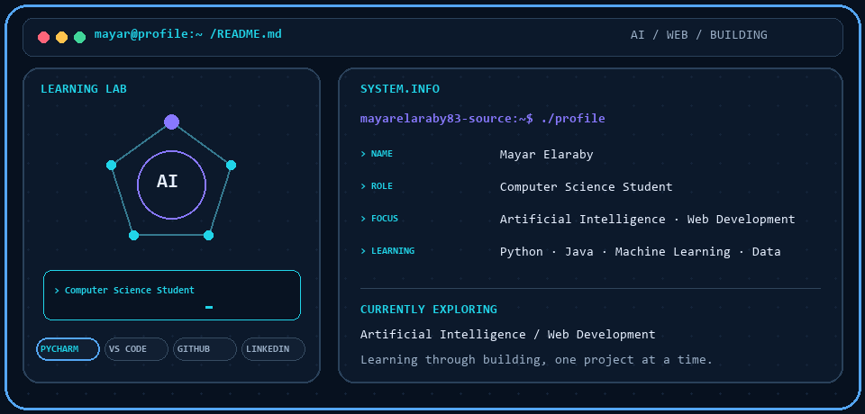

<picture>
  <source media="(prefers-color-scheme: dark)" srcset="./dark.gif">
  <source media="(prefers-color-scheme: light)" srcset="./light.gif">
  
</picture>

<h1 align="center">Hi, I'm Mayar 👋</h1>

  Computer Science student exploring Artificial Intelligence, data analysis, and web development.

### 🌱 What I'm learning
- Artificial Intelligence and Machine Learning
- Data analysis and problem solving
- Web development
- Python and Java

### 🧰 Tools & technologies

  
  
  
  
  
  
  

### 📫 Connect

Learning by building, one project at a time.

