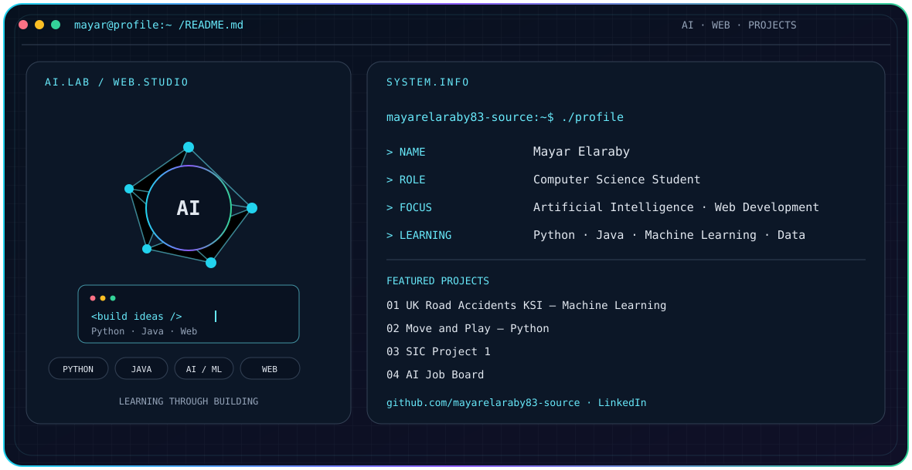

<picture><source media="(prefers-color-scheme: dark)" srcset="./dark.svg"><source media="(prefers-color-scheme: light)" srcset="./light.svg"></picture>

## Hello, I'm Mayar 👋

I’m studying Artificial Intelligence and Web Development, and building projects as I learn.

### 🌱 What I'm learning
- Artificial Intelligence and machine learning
- Web development
- Python programming and practical problem solving

### 🚀 Featured projects
- [UK Road Accidents KSI Machine Learning](https://github.com/mayarelaraby83-source/UK-Road-Accidents-KSI-Machine-Learning) — Predicting serious or fatal outcomes in UK road accidents with machine learning.
- [Move and Play — Python](https://github.com/mayarelaraby83-source/Move-and-Play.-Python-) — A Python project; see the repository for details.
- [SIC Project 1](https://github.com/mayarelaraby83-source/SIC-Project1) — A project from the Samsung Innovation Campus program.
- [AI Job Board](https://github.com/mayarelaraby83-source/ai-job-board) — An AI and web project; see the repository for current details.

### 🧰 Technologies
Artificial Intelligence · Machine Learning · Web Development · Python · Java · Data Analysis

### 📊 GitHub contributions
<picture><source media="(prefers-color-scheme: dark)" srcset="https://raw.githubusercontent.com/mayarelaraby83-source/github-snake/output/github-snake-dark.svg"><source media="(prefers-color-scheme: light)" srcset="https://raw.githubusercontent.com/mayarelaraby83-source/github-snake/output/github-snake.svg"></picture>

### 📫 Connect
[LinkedIn](https://www.linkedin.com/in/mayarelaraby/)

Learning by building, one project at a time.

